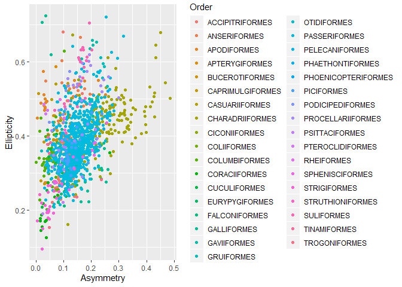
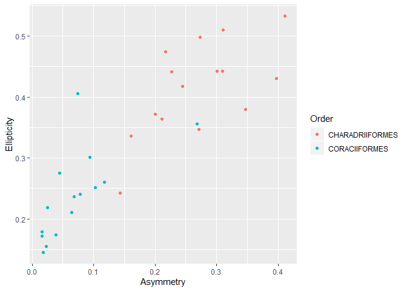
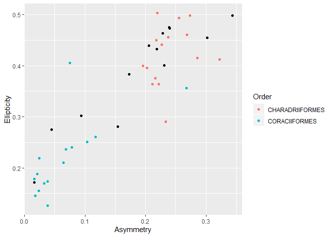
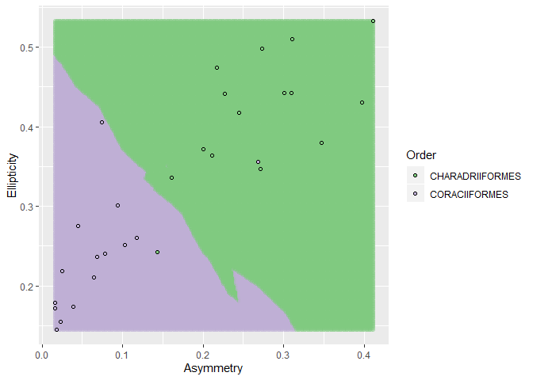
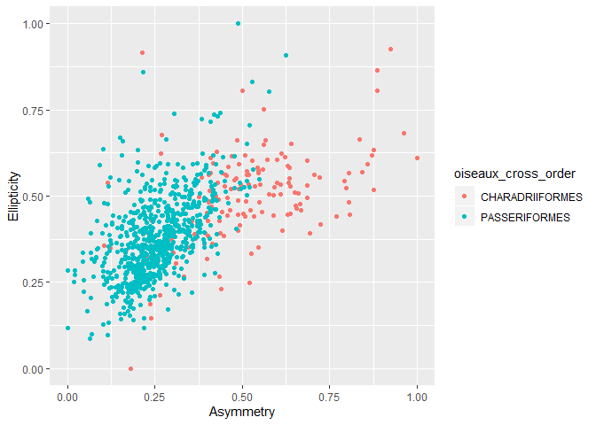
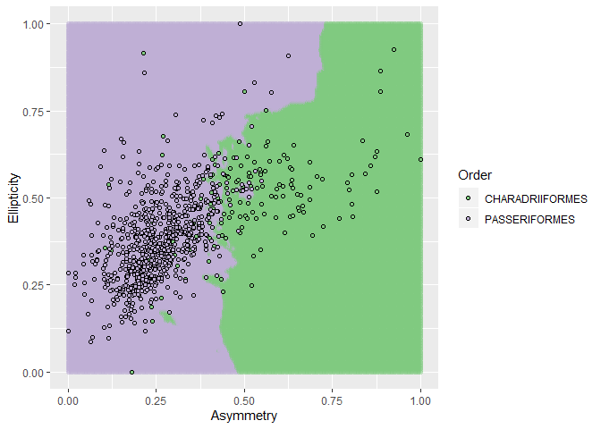

## Peut-on savoir à quel ordre d'oiseau appartient un oeuf selon ses proportions?


### Télécherger tidyverse et les données


Importation des données

```r
oiseaux <- readr::read_csv2("DataS1_Egg_shape_by_species_v2.csv")
```

```
## Using ',' as decimal and '.' as grouping mark. Use read_delim() for more control.
```

```
## Parsed with column specification:
## cols(
##   Order = col_character(),
##   Family = col_character(),
##   MVZDatabase = col_character(),
##   Species = col_character(),
##   Asymmetry = col_double(),
##   Ellipticity = col_double(),
##   `AvgLength (cm)` = col_double(),
##   `Number of images` = col_double(),
##   `Number of eggs` = col_double()
## )
```

```r
glimpse(oiseaux)
```

```
## Observations: 1,402
## Variables: 9
## $ Order              <chr> "ACCIPITRIFORMES", "ACCIPITRIFORMES", "ACCI...
## $ Family             <chr> "Accipitridae", "Accipitridae", "Accipitrid...
## $ MVZDatabase        <chr> "Accipiter badius", "Accipiter cooperii", "...
## $ Species            <chr> "Accipiter badius", "Accipiter cooperii", "...
## $ Asymmetry          <dbl> 0.1378, 0.0937, 0.1114, 0.0808, 0.0749, 0.0...
## $ Ellipticity        <dbl> 0.3435, 0.2715, 0.3186, 0.2391, 0.2543, 0.3...
## $ `AvgLength (cm)`   <dbl> 3.8642, 4.9008, 5.9863, 4.0355, 3.8700, 8.9...
## $ `Number of images` <dbl> 1, 27, 7, 13, 15, 1, 191, 1, 7, 2, 5, 130, ...
## $ `Number of eggs`   <dbl> 2, 103, 18, 61, 57, 1, 391, 2, 17, 4, 12, 3...
```
 
Nettoyer les données et sélectionner les colonnes d'intérêt

```r
oiseaux <- oiseaux[complete.cases(oiseaux),]
oiseaux <-select(oiseaux, Order, Asymmetry, Ellipticity)
```

Visualiser les données pour choisir deux groupes pour entrainer et tester le Knn

```r
oiseaux %>%
  ggplot(aes(x=Asymmetry, y=Ellipticity, colour=Order))+ # Testing the columns and visualising to select two orders to test in Knn
  geom_point()
```

<!-- -->

Sélectionner 15 données de deux ordres et les combiner pour créer un dataset pour entrainer le Knn

```r
oiseau_1 <- oiseaux[which(oiseaux$Order == 'CHARADRIIFORMES'),] # Selecting one order
nrow(oiseau_1)
```

```
## [1] 154
```

```r
oiseau_1_train <- oiseau_1[sample(1:nrow(oiseau_1), 15, #Selecting 15 random rows
   replace=FALSE),]
#view(oiseau_1)
```

```r
oiseau_2 <- oiseaux[which(oiseaux$Order == 'CORACIIFORMES'),] # Selecting one order, essayer passeriformes?
nrow(oiseau_2)
```

```
## [1] 19
```

```r
oiseau_2_train <- oiseau_2[sample(1:nrow(oiseau_2), 15, #Selecting 15 random rows
   replace=FALSE),]
#view(oiseau_2_test)
```


```r
oiseaux_data <-rbind(oiseau_1_train,oiseau_2_train) # Making a dataset with both orders
#view(oiseaux_data)
```

Visualisation des différences entre les deux ordres

```r
oiseaux_data %>%
  ggplot(aes(x=Asymmetry, y=Ellipticity, colour=Order))+ # Visualising the differences between the two orders
  geom_point()
```

<!-- -->

Création de la liste de labels pour entraîner et tester de Knn

```r
oiseaux_order <- oiseaux_data %>% # Creating the label list to train and test the Knn
  select(Order) %>% 
  mutate_if(is.character, as.factor)%>%
  unlist()
head(oiseaux_order) 
```

```
##          Order1          Order2          Order3          Order4 
## CHARADRIIFORMES CHARADRIIFORMES CHARADRIIFORMES CHARADRIIFORMES 
##          Order5          Order6 
## CHARADRIIFORMES CHARADRIIFORMES 
## Levels: CHARADRIIFORMES CORACIIFORMES
```

Sélection des données pour entraîner le modèle 

```r
oiseaux_train <- oiseaux_data%>%
  select(Asymmetry, Ellipticity) # Selecting the data to train the model 
```


Entrainement du modèle

```r
# Making the Knn model
k <- data.frame(k = 5) 
model_knn <- train(x = data.frame(oiseaux_train), y = oiseaux_order, method='knn', tuneGrid = k)
print(model_knn)
```

```
## k-Nearest Neighbors 
## 
## 30 samples
##  2 predictor
##  2 classes: 'CHARADRIIFORMES', 'CORACIIFORMES' 
## 
## No pre-processing
## Resampling: Bootstrapped (25 reps) 
## Summary of sample sizes: 30, 30, 30, 30, 30, 30, ... 
## Resampling results:
## 
##   Accuracy   Kappa    
##   0.8875229  0.7446348
## 
## Tuning parameter 'k' was held constant at a value of 5
```

Test du modèle avec une obervation fictive

```r
new_obs <- data.frame(Asymmetry = 0.4, Ellipticity = 0.3) # Fabricating a new observation
predict(object = model_knn, new_obs) # Testing the model
```

```
## [1] CHARADRIIFORMES
## Levels: CHARADRIIFORMES CORACIIFORMES
```

Sélection d'un dataset pour tester le modèle

```r
#Making a test dataframe
oiseau_1_test <- oiseaux[which(oiseaux$Order == 'CHARADRIIFORMES'),] # Selecting one order
oiseau_1_test <- oiseau_1_test[sample(1:nrow(oiseau_1_test), 10, #Selecting random rows
   replace=FALSE),]

oiseau_2_test <- oiseaux[which(oiseaux$Order == 'CORACIIFORMES'),] # Selecting one order
oiseau_2_test <- oiseau_2_test[sample(1:nrow(oiseau_2_test), 10, #Selecting random rows
   replace=FALSE),]


oiseaux_data_test <-rbind(oiseau_1_test,oiseau_2_test) # Making a dataset with both orders


oiseaux_order_test <- oiseaux_data %>% # Creating the label list to train and test the Knn
  select(Order) %>% 
  mutate_if(is.character, as.factor)%>%
  unlist()

oiseaux_test <-oiseaux_data_test %>%
  select(Asymmetry, Ellipticity)
```

Visualisation des données par rapport à ceux d'entraînement

```r
#Pour visualiser les données testées par rapport aux données de l'entraînement
#Ne marche pas pour l'instant, oiseaux_2_test n'affiche que 2 points -> oiseau_2 n'a pas assez de rangées, a changer au prochain test
ggplot() +
      # Test
      geom_point(data=oiseau_1_test, aes(x=Asymmetry, y=Ellipticity)) +
      geom_point(data=oiseau_2_test, aes(x=Asymmetry, y=Ellipticity)) +

      # Trained
      geom_point(data=oiseaux_data, aes(x=Asymmetry, y=Ellipticity, colour=Order))
```

<!-- -->

Comparaison des résultats avec les labels

```r
results <- predict(object = model_knn, oiseaux_test)
results
```

```
##  [1] CHARADRIIFORMES CHARADRIIFORMES CHARADRIIFORMES CHARADRIIFORMES
##  [5] CHARADRIIFORMES CHARADRIIFORMES CHARADRIIFORMES CHARADRIIFORMES
##  [9] CHARADRIIFORMES CHARADRIIFORMES CORACIIFORMES   CORACIIFORMES  
## [13] CHARADRIIFORMES CORACIIFORMES   CORACIIFORMES   CORACIIFORMES  
## [17] CORACIIFORMES   CORACIIFORMES   CORACIIFORMES   CORACIIFORMES  
## Levels: CHARADRIIFORMES CORACIIFORMES
```

```r
oiseaux_data_test$Results = results
#view(oiseaux_data_test)
```


Visualisation de la distribution des prédictions entre les deux ordres

```r
new_asym <- seq(from = min(oiseaux_train$Asymmetry), to = max(oiseaux_train$Asymmetry), length.out = 250)
new_ellip <- seq(from = min(oiseaux_train$Ellipticity), to = max(oiseaux_train$Ellipticity), length.out = 250)

grid_data <- expand_grid(Asymmetry = new_asym,
                         Ellipticity = new_ellip)

grid_data$Order <- predict(object = model_knn, newdata = as.data.frame(grid_data))

oiseaux_data %>% 
  ggplot(aes(x = Asymmetry, y = Ellipticity, colour=Order, fill=Order)) + 
  geom_point(data = grid_data, alpha = 0.3) +
  geom_point(alpha = 1, pch = 21, color = "black") +
  scale_color_brewer(type = "qual") + 
  scale_fill_brewer(type = "qual")
```

<!-- -->


```r
order_test <-oiseaux_data_test$Order
order_test_factor<-factor(order_test)

confusionMatrix(results,order_test_factor)
```

```
## Confusion Matrix and Statistics
## 
##                  Reference
## Prediction        CHARADRIIFORMES CORACIIFORMES
##   CHARADRIIFORMES              10             1
##   CORACIIFORMES                 0             9
##                                           
##                Accuracy : 0.95            
##                  95% CI : (0.7513, 0.9987)
##     No Information Rate : 0.5             
##     P-Value [Acc > NIR] : 2.003e-05       
##                                           
##                   Kappa : 0.9             
##                                           
##  Mcnemar's Test P-Value : 1               
##                                           
##             Sensitivity : 1.0000          
##             Specificity : 0.9000          
##          Pos Pred Value : 0.9091          
##          Neg Pred Value : 1.0000          
##              Prevalence : 0.5000          
##          Detection Rate : 0.5000          
##    Detection Prevalence : 0.5500          
##       Balanced Accuracy : 0.9500          
##                                           
##        'Positive' Class : CHARADRIIFORMES 
## 
```


## K-fold avec des nouvelles données + données normalisées


Nouvelles données prises pour un fold plus pratique

```r
oiseau_3 <- oiseaux[which(oiseaux$Order == 'PASSERIFORMES'),] # A 740 rangées
oiseaux_pour_cross<-rbind(oiseau_1, oiseau_3)

oiseaux_cross_order<-oiseaux_pour_cross$Order # Pour avoir order de oiseaux_norm

oiseaux_data_cross <- oiseaux_pour_cross %>% # Sélection des deux colonnes à travailler
  select(Asymmetry, Ellipticity)
```

Normalisation des données

```r
normalize <- function(x) {
return ((x - min(x)) / (max(x) - min(x)))
} # Fonction pour normaliser les données
oiseaux_data_cross$Asymmetry<-normalize(oiseaux_data_cross$Asymmetry)
oiseaux_data_cross$Ellipticity<-normalize(oiseaux_data_cross$Ellipticity)
oiseaux_norm<-oiseaux_data_cross # Juste pour faire un nom plus clair
```


Visualisation du modèle normalisé

```r
oiseaux_norm %>%
  ggplot(aes(x=Asymmetry, y=Ellipticity, colour=oiseaux_cross_order))+ 
  geom_point()
```

<!-- -->


```r
# Define train control for k fold cross validation
train_control <- trainControl(method="cv", number=5)
# Fit knn
k <- data.frame(k = 5) 
model_kfold <- train(x = data.frame(oiseaux_norm), y = oiseaux_cross_order, trControl =train_control,  method='knn', tuneGrid = k)

print(model_kfold)
```

```
## k-Nearest Neighbors 
## 
## 894 samples
##   2 predictor
##   2 classes: 'CHARADRIIFORMES', 'PASSERIFORMES' 
## 
## No pre-processing
## Resampling: Cross-Validated (5 fold) 
## Summary of sample sizes: 715, 716, 715, 715, 715 
## Resampling results:
## 
##   Accuracy   Kappa    
##   0.8959764  0.5946322
## 
## Tuning parameter 'k' was held constant at a value of 5
```


Visualisation de la distribution des prédictions entre les deux ordres

```r
oiseaux_norm_order <- oiseaux_norm
oiseaux_norm_order$Order <- oiseaux_cross_order
  

new_asym_norm <- seq(from = min(oiseaux_norm$Asymmetry), to = max(oiseaux_norm$Asymmetry), length.out = 250)
new_ellip_norm <- seq(from = min(oiseaux_norm$Ellipticity), to = max(oiseaux_norm$Ellipticity), length.out = 250)

grid_data_cross <- expand_grid(Asymmetry = new_asym_norm,
                         Ellipticity = new_ellip_norm)

grid_data_cross$Order <- predict(object = model_kfold, newdata = as.data.frame(grid_data_cross))

oiseaux_norm_order %>% 
  ggplot(aes(x = Asymmetry, y = Ellipticity, colour=Order, fill=Order)) + 
  geom_point(data = grid_data_cross, alpha = 0.3) +
  geom_point(alpha = 1, pch = 21, color = "black") +
  scale_color_brewer(type = "qual") + 
  scale_fill_brewer(type = "qual")
```

<!-- -->


